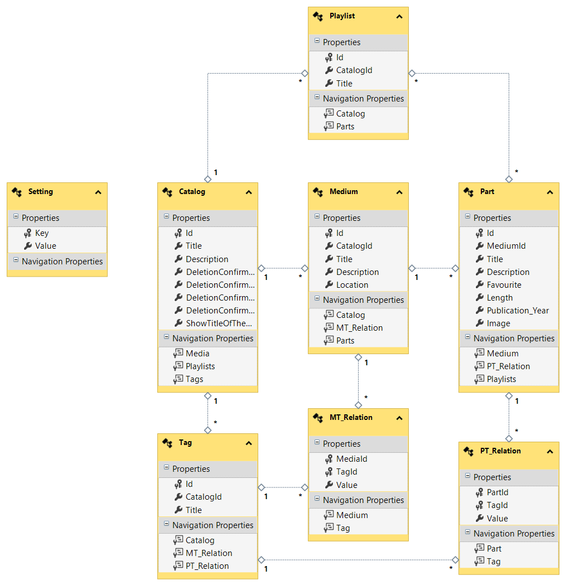

# Media Manager

## Application Description

The Media Manager application can be used to list different types of media with all their contents. Each media and media part can be categorized using tags as well as other metadata that can be used to search for specific items within the application. For a detailed description and handbook see the [Application Description](./docs/Application%20Description.md). For a feature documentation refer to the [Changelog](./Changelog.md).

> For a quick start, refer to the [Manuals](./docs/Manuals.md).

## Installation Guide

To install the application, extract the zip-file for the latest version and run the included `setup.exe`. This will either install or update the application.

## Related Files

A description of the XML-API can be found in the [XML-API-Description](./XML-API.md).

When contributing, please refer to these files:

- The [Styleguide](./docs/styles/StyleGuide.md) provides rules for the application design.
- The [Workflows](./Workflows.md) describe the necessary steps for the implementation of some new features.

A detailed view into the database definition can be achieved by viewing these files:

- [ERD](./ERD.png)
- [DB Structure](./DBStructure.sql)

