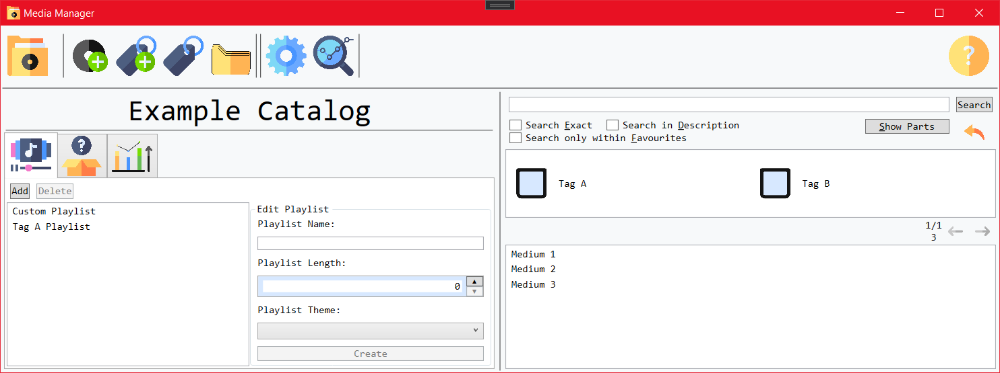
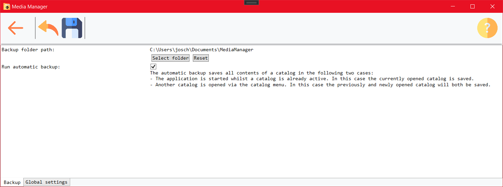
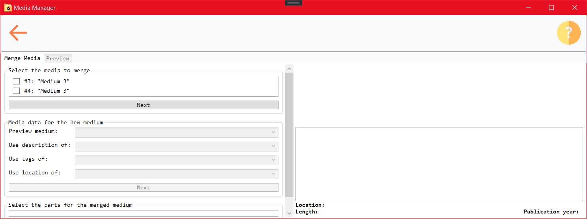

# Media Manager

  

- [1 Introduction](#1-introduction)
- [2 Use Cases](#2-use-cases)
  - [2.1 Showing Help](#21-showing-help)
  - [2.2 Using Inputs](#22-using-inputs)
  - [2.3 Editing Catalogs](#23-editing-catalogs)
  - [2.4 Selecting Catalogs](#24-selecting-catalogs)
  - [2.5 Editing Media](#25-editing-media)
  - [2.6 Editing Media Parts](#26-editing-media-parts)
  - [2.7 Editing Tags](#27-editing-tags)
  - [2.8 Searching Media](#28-searching-media)
  - [2.9 Changing Settings](#29-changing-settings)
  - [2.10 Analyzing Data](#210-analyzing-data)
  - [2.11 Editing Playlists](#211-editing-playlists)
  - [2.12 Viewing the Title of the Day](#212-viewing-the-title-of-the-day)
  - [2.13 Viewing Statistics](#213-viewing-statistics)
  - [2.14 Viewing Media](#214-viewing-media)
- [3 Application Screens](#3-application-screens)
  - [3.1 Help Menu](#31-help-menu)
  - [3.2 Catalog Menu](#32-catalog-menu)
  - [3.3 Overview Menu](#33-overview-menu)
  - [3.4 Edit Menu](#34-edit-menu)
  - [3.5 Tag Menu](#35-tag-menu)
  - [3.6 Settings Menu](#36-settings-menu)
  - [3.7 Analyze Menu](#37-analyze-menu)
- [4 Stored Data](#4-stored-data)
- [5 Definitions](#5-definitions)
  - [5.1 Types](#51-types)
    - [5.1.1 Catalog Attributes](#511-catalog-attributes)
    - [5.1.2 Media Attributes](#512-media-attributes)
    - [5.1.3 Media Part Attributes](#513-media-part-attributes)
    - [5.1.4 Tag Attributes](#514-tag-attributes)
    - [5.1.5 Playlist Attributes](#515-playlist-attributes)
    - [5.1.6 Settings](#516-settings)
  - [5.2 Algorithms](#52-algorithms)
    - [5.2.1 Search Parameters](#521-search-parameters)
    - [5.2.2 Export and Automatic Backup](#522-export-and-automatic-backup)
    - [5.2.3 Analyze Results](#523-analyze-results)
- [6 Test Cases](#6-test-cases)
  - [6.x ...](#6x-)
- [7 Appendix](#7-appendix)

## 1 Introduction

The _Media Manager_ application can be used to list different types of media with all their contents. Each media and media part can be categorized using tags as well as other metadata that can be used to search for specific items within the application. The application offers a searching functionality as well as several other support features that enhance the creation of media catalogs.

## 2 Use Cases

### 2.1 Showing Help

|                         **2.1.1** | **Opening the help menu**                                                              |
| --------------------------------: | :------------------------------------------------------------------------------------- |
|                 **Precondition:** |                                                                                        |
|                      **Actions:** | 1. Click the "Help"-Button in the menu bar                                             |
|                       **Result:** | The help menu is opened, containing different topics that lead through the application |
| **Exceptions and special cases:** | If an instance of the help menu is already opened, it will be focussed                 |

|                         **2.1.2** | **Navigating through the help menu**                                                                           |
| --------------------------------: | :------------------------------------------------------------------------------------------------------------- |
|                 **Precondition:** |                                                                                                                |
|                      **Actions:** | 1. Select a topic in the lefthand list 2. Navigate through the pages using the arrow buttons or arrow keys |
|                       **Result:** | The menu navigates through the manual and shows screenshows and explanations accordingly                       |
| **Exceptions and special cases:** |                                                                                                                |

### 2.2 Using Inputs

|                         **2.2.1** | **Using a tag input**                                                                                                                                                                                                          |
| --------------------------------: | :----------------------------------------------------------------------------------------------------------------------------------------------------------------------------------------------------------------------------- |
|                 **Precondition:** |                                                                                                                                                                                                                                |
|                      **Actions:** | 1. Left-click or right-click the checkbox                                                                                                                                                                                      |
|                       **Result:** | Left-click: the tag changes it's value from `neutral` to `positive` to `negative` and then back to `neutral` Right-click: the tag changes it's value from `neutral` to `negative` to `positive` and then back to `neutral` |
| **Exceptions and special cases:** |                                                                                                                                                                                                                                |

### 2.3 Editing Catalogs

|                         **2.3.1** | **Adding a catalog**                                                                                                    |
| --------------------------------: | :---------------------------------------------------------------------------------------------------------------------- |
|                 **Precondition:** | the catalog menu is opened                                                                                              |
|                      **Actions:** | 1. Click the "Add Catalog" button 2. Insert data for the catalog 3. Confirm the changes                         |
|                       **Result:** | 1. An edit dialog is opened 2. The data is changed 3. The dialog is closed and the catalog is created           |
| **Exceptions and special cases:** | The creation can also be cancelled If it is the first catalog to be created, the catalog is automatically activated |

|                         **2.3.2** | **Updating a catalog**                                                                                                                               |
| --------------------------------: | :--------------------------------------------------------------------------------------------------------------------------------------------------- |
|                 **Precondition:** | the catalog menu is opened and at least one catalog exists                                                                                           |
|                      **Actions:** | 1. Select a catalog in the list 2. Click the "Edit Catalog" button 3. Insert data for the catalog 4. Confirm the changes                 |
|                       **Result:** | 1. The "Edit" button is available 2. The edit dialog is opened 3. The data is changed 4. The dialog is closed and the catalog is updated |
| **Exceptions and special cases:** | The update can also be cancelled                                                                                                                     |

|                         **2.3.3** | **Deleting a catalog**                                                                                                                                       |
| --------------------------------: | :----------------------------------------------------------------------------------------------------------------------------------------------------------- |
|                 **Precondition:** | the catalog menu is opened and at least one catalog exists                                                                                                   |
|                      **Actions:** | 1. Select a catalog in the list 2. Click the "Delete Catalog" button 3. Confirm the deletion confirmation                                            |
|                       **Result:** | The catalog is deleted                                                                                                                                       |
| **Exceptions and special cases:** | The deletion can also be cancelled If the catalog was active, the first catalog in the list is selected as the active one in case another catalog exists |

|                         **2.3.4** | **Exporting a catalog**                                                                                                                                                                                                                                                                                           |
| --------------------------------: | :---------------------------------------------------------------------------------------------------------------------------------------------------------------------------------------------------------------------------------------------------------------------------------------------------------------- |
|                 **Precondition:** | the catalog menu is opened and at least one catalog exists                                                                                                                                                                                                                                                        |
|                      **Actions:** | 1. Select a catalog in the list 2. Click the "Export Catalog" button 3. Select an export file                                                                                                                                                                                                             |
|                       **Result:** | The catalog is exported                                                                                                                                                                                                                                                                                           |
| **Exceptions and special cases:** | The export can also be cancelled It is also possible to select an export type for the mobile version of the application that exports a selection of the stored attributes to a file that can be imported in the mobile application The mobile export is not available yet |

|                         **2.3.5** | **Importing a catalog**                                                                                               |
| --------------------------------: | :-------------------------------------------------------------------------------------------------------------------- |
|                 **Precondition:** | the catalog menu is opened                                                                                            |
|                      **Actions:** | 1. Click the "Import Catalog" button 2. Select an import file                                                     |
|                       **Result:** | The catalog is imported as a new catalog                                                                              |
| **Exceptions and special cases:** | The import can also be cancelled If it is the first catalog to be created, the catalog is automatically activated |

### 2.4 Selecting Catalogs

|                         **2.4.1** | **Switching to a catalog**                                                                                                                         |
| --------------------------------: | :------------------------------------------------------------------------------------------------------------------------------------------------- |
|                 **Precondition:** | the catalog menu is opened and at least one inactive catalog exists                                                                                |
|                      **Actions:** | 1. Double-click in inactive catalog in the list                                                                                                    |
|                       **Result:** | The catalog is actived If the setting is not deactivated, both the now deactivated and now activated catalog will be exported to a backup file |
| **Exceptions and special cases:** | In case another catalog was active before, the old active catalog will be deactivated                                                              |

### 2.5 Editing Media

|                         **2.5.1** | **Adding a medium**                                                                |
| --------------------------------: | :--------------------------------------------------------------------------------- |
|                 **Precondition:** | the overview menu is opened                                                        |
|                      **Actions:** | 1. Click the "Add Medium" button 2. Insert data 3. Save the changes        |
|                       **Result:** | 1. The edit menu is opened 2. The data is changed 3. The medium is created |
| **Exceptions and special cases:** | The creation can also be cancelled                                                 |

|                         **2.5.2** | **Updating a medium**                                                        |
| --------------------------------: | :--------------------------------------------------------------------------- |
|                 **Precondition:** | the edit menu is opened                                                      |
|                      **Actions:** | 1. Click the "Edit Medium" button 2. Insert data 3. Save the changes |
|                       **Result:** | The medium is updated                                                        |
| **Exceptions and special cases:** | The update can also be cancelled                                             |

|                         **2.5.3** | **Deleting a medium**                                                                              |
| --------------------------------: | :------------------------------------------------------------------------------------------------- |
|                 **Precondition:** | the edit menu is opened                                                                            |
|                      **Actions:** | 1. Click the "Delete Medium" button 2. If configured, confirm the deletion confirmation dialog |
|                       **Result:** | The medium is deleted                                                                              |
| **Exceptions and special cases:** | If the deletion confirmation dialog is active, the deletion can also be cancelled                  |

### 2.6 Editing Media Parts

|                         **2.6.1** | **Adding a media part**              |
| --------------------------------: | :----------------------------------- |
|                 **Precondition:** | the edit menu is opened in edit mode |
|                      **Actions:** | 1. Click the "Add Media Part" button |
|                       **Result:** | An empty part is added to the medium |
| **Exceptions and special cases:** |                                      |

|                         **2.6.2** | **Updating a media part**                                               |
| --------------------------------: | :---------------------------------------------------------------------- |
|                 **Precondition:** | the edit menu is opened in edit mode and at least one media part exists |
|                      **Actions:** | 1. Select the media part to edit 2. Insert data                     |
|                       **Result:** | The media part is updated                                               |
| **Exceptions and special cases:** |                                                                         |

|                         **2.6.3** | **Deleting a media part**                                                                                                                     |
| --------------------------------: | :-------------------------------------------------------------------------------------------------------------------------------------------- |
|                 **Precondition:** | the edit menu is opened in edit mode and at least one media part exists                                                                       |
|                      **Actions:** | 1. Select the media part to delete 2. Click the "Delete Media Part" button 3. If configured, confirm the deletion confirmation dialog |
|                       **Result:** | The media part is deleted                                                                                                                     |
| **Exceptions and special cases:** | If the deletion confirmation dialog is active, the deletion can also be cancelled                                                             |

### 2.7 Editing Tags

|                         **2.7.1** | **Adding a tag**                                                               |
| --------------------------------: | :----------------------------------------------------------------------------- |
|                 **Precondition:** | the overview menu or tag menu is opened                                        |
|                      **Actions:** | 1. Click the "Add Tag" button 2. Insert a tag name 3. Save the changes |
|                       **Result:** | The tag is created                                                             |
| **Exceptions and special cases:** | The creation can also be cancelled                                             |

|                         **2.7.2** | **Renaming a tag**                                                                                              |
| --------------------------------: | :-------------------------------------------------------------------------------------------------------------- |
|                 **Precondition:** | the tag menu is opened and at least one tag exists                                                              |
|                      **Actions:** | 1. Select the tag to rename 2. Click the "Edit Tag" button 3. Insert a tag name 4. Save the changes |
|                       **Result:** | The tag is renamed                                                                                              |
| **Exceptions and special cases:** | The name update can also be cancelled                                                                           |

|                         **2.7.3** | **Deleting a tag**                                                                                                              |
| --------------------------------: | :------------------------------------------------------------------------------------------------------------------------------ |
|                 **Precondition:** | the tag menu is opened and at least one tag exists                                                                              |
|                      **Actions:** | 1. Select the tag to delete 2. Click the "Delete Tag" button 3. If configured, confirm the deletion confirmation dialog |
|                       **Result:** | The tag is deleted                                                                                                              |
| **Exceptions and special cases:** | If the deletion confirmation dialog is active, the deletion can also be cancelled                                               |

|                         **2.7.4** | **Editing tags of media and their parts**                                                                                    |
| --------------------------------: | :--------------------------------------------------------------------------------------------------------------------------- |
|                 **Precondition:** | the tag menu is opened and at least one tag and media with parts exist                                                       |
|                      **Actions:** | 1. Select a tag 2. Select a medium 3. Change the assigned values for the medium or its parts 4. Save the changes |
|                       **Result:** | The changed tag values are updated                                                                                           |
| **Exceptions and special cases:** | The update can also be cancelled                                                                                             |

### 2.8 Searching Media

|                         **2.8.1** | **Search by Text**                                                              |
| --------------------------------: | :------------------------------------------------------------------------------ |
|                 **Precondition:** | the overview menu is opened                                                     |
|                      **Actions:** | 1. Insert a search text in the text area 2. Start the search or press enter |
|                       **Result:** | The search result is updated accordingly                                        |
| **Exceptions and special cases:** |                                                                                 |

|                         **2.8.2** | **Search by Tags**                                             |
| --------------------------------: | :------------------------------------------------------------- |
|                 **Precondition:** | the overview menu is opened                                    |
|                      **Actions:** | 1. Select tags in the search tag input 2. Start the search |
|                       **Result:** | The search result is updated accordingly                       |
| **Exceptions and special cases:** |                                                                |

### 2.9 Changing Settings

|                         **2.9.1** | **Changing the language**                                                    |
| --------------------------------: | :--------------------------------------------------------------------------- |
|                 **Precondition:** | the settings menu is opened                                                  |
|                      **Actions:** | 1. Select a language from the dropdown 2. Save or apply the new settings |
|                       **Result:** | The language is changed                                                      |
| **Exceptions and special cases:** | Changing the settings can also be cancelled                                  |

|                         **2.9.2** | **Configuring visible features for the overview menu**                                                                          |
| --------------------------------: | :------------------------------------------------------------------------------------------------------------------------------ |
|                 **Precondition:** | the settings menu is opened                                                                                                     |
|                      **Actions:** | 1. Enable or disable a feature in the list 2. Save or apply the new settings                                                |
|                       **Result:** | The selected features are enabled and the other features are disabled This effects the multi use control on the main screen |
| **Exceptions and special cases:** | Changing the settings can also be cancelled                                                                                     |

|                         **2.9.3** | **Changing the result list length**                                                    |
| --------------------------------: | :------------------------------------------------------------------------------------- |
|                 **Precondition:** | the settings menu is opened                                                            |
|                      **Actions:** | 1. Select a result list length from the dropdown 2. Save or apply the new settings |
|                       **Result:** | The result list length is changed                                                      |
| **Exceptions and special cases:** | Changing the settings can also be cancelled                                            |

|                         **2.9.4** | **Changing the backup configuration**                                                                                        |
| --------------------------------: | :--------------------------------------------------------------------------------------------------------------------------- |
|                 **Precondition:** | the settings menu is opened                                                                                                  |
|                      **Actions:** | 1. Change the folder path for the backup 2. Enable or disable the automatic backup 3. Save or apply the new settings |
|                       **Result:** | The backup configuration is changed                                                                                          |
| **Exceptions and special cases:** | Changing the settings can also be cancelled                                                                                  |

|                         **2.9.5** | **Enabling or disabling deletion confirmations**                                                                            |
| --------------------------------: | :-------------------------------------------------------------------------------------------------------------------------- |
|                 **Precondition:** | the settings menu is opened and at least one catalog exists                                                                 |
|                      **Actions:** | 1. Enable or disable the deletion confirmations Change the folder path for the backup 2. Save or apply the new settings |
|                       **Result:** | The deletion confirmation settings are changed                                                                              |
| **Exceptions and special cases:** | Changing the settings can also be cancelled                                                                                 |

|                         **2.9.6** | **Changing the title of the day display**                                                           |
| --------------------------------: | :-------------------------------------------------------------------------------------------------- |
|                 **Precondition:** | the settings menu is opened and at least one catalog exists                                         |
|                      **Actions:** | 1. Change the mode in which the title of the day is displayed 2. Save or apply the new settings |
|                       **Result:** | The title of the day configuration is changed                                                       |
| **Exceptions and special cases:** | Changing the settings can also be cancelled                                                         |

### 2.10 Analyzing Data

|                        **2.10.1** | **Finding empty media**                                                             |
| --------------------------------: | :---------------------------------------------------------------------------------- |
|                 **Precondition:** | the analysis menu is opened and the according option is selected                    |
|                      **Actions:** | 1. Select a medium from the result list 2. Edit the medium and save the changes |
|                       **Result:** | The result list is updated                                                          |
| **Exceptions and special cases:** | There may not be any results                                                        |

|                        **2.10.2** | **Finding media with unset general tags**                                           |
| --------------------------------: | :---------------------------------------------------------------------------------- |
|                 **Precondition:** | the analysis menu is opened and the according option is selected                    |
|                      **Actions:** | 1. Select a medium from the result list 2. Edit the medium and save the changes |
|                       **Result:** | The result list is updated                                                          |
| **Exceptions and special cases:** | There may not be any results                                                        |

|                        **2.10.3** | **Find media with doubled names**                                                                                                                                                                         |
| --------------------------------: | :-------------------------------------------------------------------------------------------------------------------------------------------------------------------------------------------------------- |
|                 **Precondition:** | the analysis menu is opened and the according option is selected                                                                                                                                          |
|                      **Actions:** | 1. Select a doubled media name from the result list 2. Click the "Edit" button 3. Select the media to merge 4. Select the media information and media parts to use 5. Confirm the preview |
|                       **Result:** | The selected media are merged and the result list is updated                                                                                                                                              |
| **Exceptions and special cases:** | There may not be any results                                                                                                                                                                              |

|                        **2.10.4** | **Find media or parts without a given attribute value**                                                       |
| --------------------------------: | :------------------------------------------------------------------------------------------------------------ |
|                 **Precondition:** | the analysis menu is opened and the according option is selected                                              |
|                      **Actions:** | 1. Select a media or media part from the result list 2. Edit the media or media part and save the changes |
|                       **Result:** | The result list is updated                                                                                    |
| **Exceptions and special cases:** | There may not be any results                                                                                  |

### 2.11 Editing Playlists

|                        **2.11.1** | **Viewing playlists**                                         |
| --------------------------------: | :------------------------------------------------------------ |
|                 **Precondition:** | the overview menu is opened; the according setting is enabled |
|                      **Actions:** | 1. Select a playlist in the playlist tab                      |
|                       **Result:** | The titles in the playlist are shown                          |
| **Exceptions and special cases:** |                                                               |

|                        **2.11.2** | **Creating a playlist**                                                                                                                                                              |
| --------------------------------: | :----------------------------------------------------------------------------------------------------------------------------------------------------------------------------------- |
|                 **Precondition:** | the overview menu is opened; the according setting is enabled                                                                                                                        |
|                      **Actions:** | 1. Click the "Add Playlist" button in the playlist control 2. Insert a name for the playlist 3. Optionally select a tag and playlist length 4. Click the "Create" button |
|                       **Result:** | The playlist is created If a tag and length were inserted, the playlist is randomly filled with parts that match the given tag until the length is reached                       |
| **Exceptions and special cases:** | The playlist may be shorter then the selected length if no more media parts exist for the tag                                                                                        |

|                        **2.11.3** | **Adding elements to a playlist**                                                                                                                                                   |
| --------------------------------: | :---------------------------------------------------------------------------------------------------------------------------------------------------------------------------------- |
|                 **Precondition:** | the overview menu is opened, there exists one playlist and there exist media with parts; the according setting is enabled                                                           |
|                      **Actions:** | 1. Search titles within the search control 2. Right click within the search result list 3. Select the add to playlist option 4. Select a playlist to add the element to |
|                       **Result:** | The playlist is updated                                                                                                                                                             |
| **Exceptions and special cases:** |                                                                                                                                                                                     |

|                        **2.11.4** | **Removing elements from a playlist**                                                         |
| --------------------------------: | :-------------------------------------------------------------------------------------------- |
|                 **Precondition:** | the overview menu is opened and there exists one playlist; the according setting is enabled   |
|                      **Actions:** | 1. Select a playlist within the playlist control 2. Click the "X" button next to an entry |
|                       **Result:** | The entry is removed                                                                          |
| **Exceptions and special cases:** |                                                                                               |

|                                                                                   **2.11.5** | **Deleting a playlist**                                                                     |
| -------------------------------------------------------------------------------------------: | :------------------------------------------------------------------------------------------ |
|                                                                            **Precondition:** | the overview menu is opened and there exists one playlist; the according setting is enabled |
| \*\*Actions: Playlist" button 3. If configured, confirm the deletion confirmation dialog |
|                                                                                  **Result:** | The playlist is deleted                                                                     |
|                                                            **Exceptions and special cases:** | If the deletion confirmation dialog is active, the deletion can also be cancelled           |

### 2.12 Viewing the Title of the Day

|                        **2.12.1** | **Viewing the title of the day**                                                                                                          |
| --------------------------------: | :---------------------------------------------------------------------------------------------------------------------------------------- |
|                 **Precondition:** | the overview menu is opened and media with parts exist; the according setting is enabled                                                  |
|                      **Actions:** | 1. Select the title of the day control                                                                                                    |
|                       **Result:** | The current title of the day is shown                                                                                                     |
| **Exceptions and special cases:** | If no media exist, no title of the day can be shown The control can also be configured to show a whole medium instead of a media part |

|                        **2.12.2** | **Selecting a new title of the day**                                                                               |
| --------------------------------: | :----------------------------------------------------------------------------------------------------------------- |
|                 **Precondition:** | the overview menu is opened and media with parts exist; the according setting is enabled                           |
|                      **Actions:** | 1. Click the "Next" button in the title of the day control                                                         |
|                       **Result:** | Another title is shown                                                                                             |
| **Exceptions and special cases:** | The currently shown title may not change if no further titles exist or if the same title is rolled again by chance |

### 2.13 Viewing Statistics

|                        **2.13.1** | **Viewing the statistics**                                                                                 |
| --------------------------------: | :--------------------------------------------------------------------------------------------------------- |
|                 **Precondition:** | the overview menu is opened; the according setting is enabled                                              |
|                      **Actions:** | 1. Select the statistics control                                                                           |
|                       **Result:** | Overview statistics are shown regarding the media and their parts (such as count of media and their parts) |
| **Exceptions and special cases:** |                                                                                                            |

### 2.14 Viewing Media

|                        **2.14.1** | **Opening a medium or part from the search result**         |
| --------------------------------: | :---------------------------------------------------------- |
|                 **Precondition:** | a medium or part is visible in the search result            |
|                      **Actions:** | 1. Double click the medium or part                          |
|                       **Result:** | The edit menu is opened showing the selected medium or part |
| **Exceptions and special cases:** |                                                             |

|                        **2.14.2** | **Opening a part from a playlist**                |
| --------------------------------: | :------------------------------------------------ |
|                 **Precondition:** | a part is visible in a playlist                   |
|                      **Actions:** | 1. Double click the part                          |
|                       **Result:** | The edit menu is opened showing the selected part |
| **Exceptions and special cases:** |                                                   |

## 3 Application Screens

The _Media Manager_ supports the user with a clear UI design that highlights the most important actions using individual icons. That way, the user can intuitively use the application.

### 3.1 Help Menu

The help menu can be reached from all other menus by using the "Help" button in the menu bar. The help menu shows different topics in the lefthand list from which the user can select a desired topic. The user can then navigate through the topics and pages of the topics by using the arrow buttons or the arrow keys.

### 3.2 Catalog Menu

Within the catalog menu, catalogs can be created, edited or deleted. Furthermore the active catalog can be selected or catalogs can be exported and imported.

The catalog menu is the first menu that will be opened, if no catalog exists yet. The menu then offers the access to the catalog creation as well as the settings and help menu.

### 3.3 Overview Menu

The overview menu provides the searching functionality on the righthand side of the menu as well as the access to all other menus.

On the lefthand side of the menu, further controls can be enabled that allow editing playlists, viewing the title of the day or viewing statistics.

To open an existing medium from the overview menu, an item in a playlist or the search result can be double clicked.

### 3.4 Edit Menu

Within the edit menu, media and their parts can be edited. When creating a new medium, the menu will automatically be opened in edit mode. Otherwise, the chosen medium will be shown in viewing mode and can be edited, by clicking the "Edit Medium" button in the menu bar.

Then the medium can be edited with all its parts. Changes must be saved explicitly.

### 3.5 Tag Menu

The tag menu lists all tags that exist within the application and offers the editing and deletion functionality for those tags.

By selecting a tag and a medium within the menu, the tag values for this medium and its parts can be edited on the righthand side of the menu. Changes must be saved explicitly.

### 3.6 Settings Menu

Within the settings menu, several tabs allow the access to different configurations. The catalog settings are only available if any catalog exists. Changes must be saved explicitly.

### 3.7 Analyze Menu

The analyze menu provides the access to differnt inconsistencies that were found within the currently active catalog. This includes empty or doubled media as well as missing attributes for media or their parts.

The found items are shown in a preview and can then be opened in the edit menu by clicking the edit button.

In case of doubled media, the items are not edited in the edit menu. Rather they are opened in a merge menu that allows the combination of the desired media information and parts to create a single combined medium instead of the doubled items.

## 4 Stored Data

The application stores the data within a local MSSQL database.

This data will only be stored locally as long as the user does not copy it manually. The user must ensure to keep the device safe and secure the device access appropriately to keep the data safe.

If desired, the user can export the data to xml-Files outside the application. This can be used to transfer data between different devices or to create a backup.

## 5 Definitions

### 5.1 Types

An overview of the data types can be viewed in the following diagram:

#### 5.1.1 Catalog Attributes

Catalogs contain the following data:

|                              Attribute | Data Type              | Explanation                                                                           |
| -------------------------------------: | :--------------------- | :------------------------------------------------------------------------------------ |
|                                     Id | Numeric                | Identification of the catalog                                                         |
|                                  Title | Text (128 characters)  | Title of the catalog                                                                  |
|                            Description | Text (2048 characters) | Detailed description of the catalog                                                   |
|           Deletion Confirmation Medium | True/False             | Whether the application asks for a deletion confirmation when deleting a whole medium |
|             Deletion Confirmation Part | True/False             | Whether the application asks for a deletion confirmation when deleting a media part   |
|              Deletion Confirmation Tag | True/False             | Whether the application asks for a deletion confirmation when deleting a tag          |
|         Deletion Confirmation Playlist | True/False             | Whether the application asks for a deletion confirmation when deleting a playlist     |
| Show whole medium for title of the day | True/false             | Whether to show a media part or a whole medium within the title of the day control    |

#### 5.1.2 Media Attributes

Media contain the following data:

|   Attribute | Data Type             | Explanation                               |
| ----------: | :-------------------- | :---------------------------------------- |
|          Id | Numeric               | Identification of the medium              |
|  Catalog Id | Numeric               | Reference to the parent catalog           |
|       Title | Text (128 characters) | Title of the medium                       |
| Description | Text (512 characters) | Detailed description of the medium        |
|    Location | Text (128 characters) | Place where the medium is located         |
|        Tags | List of Tags          | Categories the medium is contained within |

#### 5.1.3 Media Part Attributes

Each media can hold several parts.

Media parts contain the following data:

|        Attribute | Data Type             | Explanation                             |
| ---------------: | :-------------------- | :-------------------------------------- |
|               Id | Numeric               | Identification of the part              |
|        Medium Id | Numeric               | Reference to the parent medium          |
|            Title | Text (128 characters) | Title of the part                       |
|      Description | Text (512 characters) | Detailed description of the part        |
|        Favourite | True/False            | Whether the part is a favourite         |
|           Length | Numeric               | Length of the part                      |
| Publication Year | Numeric               | Publication year of the part            |
|            Image | Image                 | Cover image or thumbnail of the part    |
|             Tags | List of Tags          | Categories the part is contained within |

If a tag for the whole media has a set value (not neutral), all media parts on this media will have the same value for that tag. Media parts can only redefine the neutral tags of the parent media.

#### 5.1.4 Tag Attributes

Each tag that is set for a medium or a medium part can have one of the follow values:

- neutral: no data inserted for the category
- positive: the media or part is contained within the category
- negative: the media or part is not contained within the category

Configured tags contain the following data:

|  Attribute | Data Type             | Explanation                     |
| ---------: | :-------------------- | :------------------------------ |
|         Id | Numeric               | Identification of the tag       |
| Catalog Id | Numeric               | Reference to the parent catalog |
|      Title | Text (128 characters) | Title of the tag                |

#### 5.1.5 Playlist Attributes

Playlists can contain several parts.

Playlists contain the following data:

|  Attribute | Data Type             | Explanation                                  |
| ---------: | :-------------------- | :------------------------------------------- |
|         Id | Numeric               | Identification of the playlist               |
| Catalog Id | Numeric               | Reference to the parent catalog              |
|      Title | Text (128 characters) | Title of the playlist                        |
|      Parts | List of Parts         | Parts that are contained within the playlist |

#### 5.1.6 Settings

Global settings that are independent from catalog contents are stored in a settings table.

Each setting contains the following data:

| Attribute | Data Type             | Explanation                   |
| --------: | :-------------------- | :---------------------------- |
|       Key | Text (512 characters) | Identification of the setting |
|     Value | Text (512 characters) | Content of the setting        |

By default, the application contains the following settings:

|                            Key | Data Type             | Explanation                                                        | Default                                                                |
| -----------------------------: | :-------------------- | :----------------------------------------------------------------- | :--------------------------------------------------------------------- |
|             RESULT_LIST_LENGTH | Numeric               | Length of the pages of any result list within the application      | 20                                                                     |
|     VISIBILITY_PLAYLIST_EDITOR | True/False            | Whether the playlist editor will be shown in the overview menu     | True                                                                   |
|    VISIBILITY_TITLE_OF_THE_DAY | True/False            | Whether the title of the day will be shown in the overview menu    | True                                                                   |
| VISIBILITY_STATISTICS_OVERVIEW | True/False            | Whether the statistics overview will be shown in the overview menu | True                                                                   |
|                    BACKUP_PATH | Text (512 characters) | Path to the backup folder in which the backup files will be stored | A folder named `MediaManager` within the documents of the current user |
|                 BACKUP_ENABLED | True/False            | Whether an automatic backup will be created                        | True                                                                   |
|             CURRENT_CATALOG_ID | Numeric               | Reference to the currently active catalog                          | -                                                                      |

### 5.2 Algorithms

#### 5.2.1 Search Parameters

| Parameter               | Explanation                                                                                                                |
| :---------------------- | :------------------------------------------------------------------------------------------------------------------------- |
| Search Text             | String to use for the applied search                                                                                       |
| Tags                    | Tags to use for the applied search                                                                                         |
| Exact Mode              | In exact mode, the ticked tags must match exactly; otherwise the ticked tags cannot have the opposite value                |
| Search Description Mode | Whether the text should also be searched within the descriptions; otherwise only the media and part titles will be scanned |
| Favourite Only Mode     | Filter out all parts that are not marked as favourite                                                                      |
| Result List Type        | Whether to show the results as a list of media or as a list of parts                                                       |

Default search parameters: By default, the search text is empty and no tag is selected. Furthermore no mode will be active and the result list will show the media.

#### 5.2.2 Export and Automatic Backup

The user can export a selected catalog manually by using the export button in the catalog menu. For any export, the default file name will be the name of the exported catalog.

Furthermore, an automatic backup will be performed in the following two cases:

- The application is started whilst a catalog is already active. In this case the currently opened catalog is saved.
- Another catalog is opened via the catalog menu. In this case the previously and newly opened catalog will both be saved.

This backup only is performed, if the corresponding setting is not disabled. If enabled, the backup files would be stored into the configured backup folder. Each file is then named after the exported catalog and a timestamp of the export.

#### 5.2.3 Analyze Results

The analyze menu checks the currently active catalog for inconsistencies. Those include the following:

|                Analysis mode | Explanation                                                                                                  |
| ---------------------------: | :----------------------------------------------------------------------------------------------------------- |
|                 Empty medium | The medium does not contain any parts.                                                                       |
|               Doubled medium | Several media share the exact same title.                                                                    |
|           Missing medium tag | All parts of a medium share the same non-neutral tag value but the value is not globally set for the medium. |
|      Missing media attribute | A given attribute (selectable within a dropdown) is not set for the medium.                                  |
| Missing media oart attribute | A given attribute (selectable within a dropdown) is not set for the media part.                              |

## 6 Test Cases

### 6.x ...

|         **6.x.x** | **Title** |
| ----------------: | :-------- |
| **Precondition:** | ...       |
|      **Actions:** | 1. ...    |
|       **Result:** | (1.) ...  |

## 7 Appendix

The illustrations were created using either `draw.io` or a running instance of the application.
