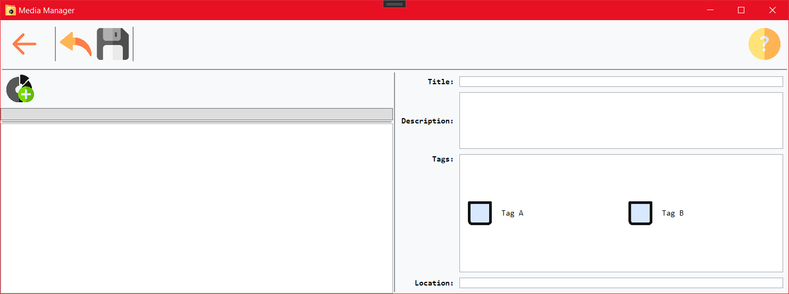
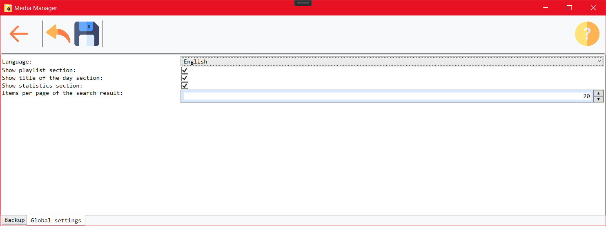

# Media Manager

  

- [1 Einleitung](#1-einleitung)
- [2 Hilfemenü](#2-hilfemenü)
- [3 Kataloge bearbeiten](#3-kataloge-bearbeiten)
- [4 Übersichtsmenü](#4-übersichtsmenü)
  - [4.1 Medien hinzufügen](#41-medien-hinzufügen)
  - [4.2 Medien und Medienteile suchen](#42-medien-und-medienteile-suchen)
- [5 Medien und Medienteile bearbeiten](#5-medien-und-medienteile-bearbeiten)
- [6 Einstellungen](#6-einstellungen)
- [7 Analysemenü](#7-analysemenü)

## 1 Einleitung

Die _Media Manager_ Anwendung kann genutzt werden, um verschiedene Typen von Medien aufzulisten. Diese Medien und Medienteile können kategorisiert und durch weitere Metadaten beschrieben werden und anhand dieser Daten innerhalb der Anwendung gesucht werden. Die Anwendung bietet eine Suchfunktion, sowie andere unterstützende Funktionen, die die Erstellung von Medien erleichtern.

## 2 Hilfemenü

Das Hilfemenü kann aus jedem Menü heraus über den "Hilfe" Button in der Menüleiste erreicht werden. Das Hilfemenü zeigt verschiedene Themen in der Liste auf der linken Seite an, aus der das gewünschte Thema gewählt werden kann. Dann kann mit den Pfeil-Buttons oder Pfeil-Tasten durch die Seiten des Themas navigiert werden.

## 3 Kataloge bearbeiten

Im Katalogmenü können Kataloge erstellt, bearbeitet und gelöscht werden. Außerdem können der aktive Katalog ausgewählt und Kataloge exportiert und importiert werden.

Das Katalogmenü ist das erste Menü, das beim Start der Anwendung geöffnet wird, wenn noch kein Katalog existiert. Das Menü bietet dann die Möglichkeit der Erstellung von Katalogen und den Zugriff auf die Einstellungen und das Hilfemenü.

Beim Klick auf den "Katalog hinzufügen" Button in der Menüleiste wird ein Dialog geöffnet, in dem der Titel für den zu erstellenden Katalog festgelegt wird.

## 4 Übersichtsmenü

Das Übersichtsmenü bietet auf der rechten Seite die Suchfunktion, sowie den Zugriff auf alle weiteren Menüs.

Auf der linken Seite des Menüs sind weitere Funktionen verfügbar, die die Bearbeitung von Playlisten, die Ansicht von Titelvorschlägen und Statistiken bieten.

### 4.1 Medien hinzufügen

Medien können über den "Medium hinzufügen" Button in der Menüleiste erzeugt werden. So wird das Bearbeitungsmenü für die Erstellung eines neuen Mediums geöffnet.

### 4.2 Medien und Medienteile suchen

Die Suche auf der rechten Seite des Übersichtsmenüs bietet die Filterung von Medien und Medienteilen nach Titel, Kategorien und weiteren Attributen.

Um ein existierendes Medium aus dem Übersichtsmenü zu öffnen, kann das entsprechende Element in einer Playlist oder den Suchergebnissen durch einen Doppelklick im Bearbeitungsmenü geöffnet werden.

## 5 Medien und Medienteile bearbeiten

Wurde ein Medium im Bearbeitungsmenü geöffnet, können die Medien- und Medienteilinformationen bearbeitet werden. Dafür kann die Bearbeitung über den Button in der Menüleiste gestartet werden, insofern das Medium zur Ansicht geöffnet wurde. Danach können Änderungen vorgenommen und gespeichert werden.

Medien und Medienteile werden jeweils durch einen Titel beschrieben und können weitere Informationen enthalten, wie beispielsweise eine Beschreibung und Kategorien. Medienteile können zudem weitere Daten wie Bilder, eine Länge und ein Veröffentlichungsjahr enthalten, während Medien einen Aufbewahrungsort aufweisen können

Wenn Kategorien für ein gesamtes Medium gesetzt werden, werden diese Werte auch auf alle enthaltenen Medienteile anwendet.

## 6 Einstellungen

Die Einstellungen erlauben die Konfiguration der Anwendung. Das beinhaltet die Konfiguration der automatischen Sicherung, Katalogeinstellungen und weitere globale Einstellungen wie die Sprache und die im Übersichtsmenü verfügbaren Funktionen.

## 7 Analysemenü

Das Analysemenü bietet den Zugriff auf verschiedene Inkonsistenzen, die im aktuell geöffneten Katalog gefunden wurden. Dies beinhaltet leere oder doppelte Medien, sowie fehlende Attribute von Medien oder Medienteilen.

Die gefundenen Elemente werden in einer Voransicht dargestellt und können durch Klick auf den "Bearbeiten" Button im Bearbeitungsmenü geöffnet werden.

Im Fall von doppelten Medien werden die Elemente nicht im Bearbeitungsmenü geöffnet. Stattdessen wird ein Zusammenführungsmenü geöffnet, in dem die zusammenzuführenden Medien, Medieninformationen und Medienteile zu einem gemeinsamen Medium zusammengeführt werden, um die doppelten Medien zu ersetzen.

