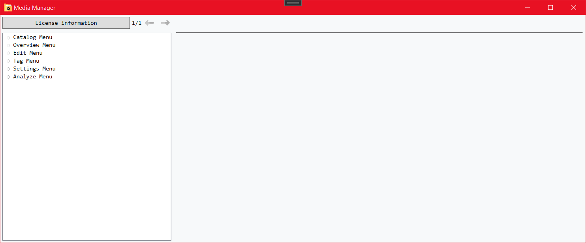

# Media Manager

  

- [1 Introduction](#1-introduction)
- [2 Help Menu](#2-help-menu)
- [3 Editing Catalogs](#3-editing-catalogs)
- [4 Overview Menu](#4-overview-menu)
  - [4.1 Adding Media](#41-adding-media)
  - [4.2 Searching Media and Media Parts](#42-searching-media-and-media-parts)
- [5 Editing Media and Media Parts](#5-editing-media-and-media-parts)
- [6 Settings](#6-settings)
- [7 Analyze Menu](#7-analyze-menu)

## 1 Introduction

The _Media Manager_ application can be used to list different types of media with all their contents. Each media and media part can be categorized using tags as well as other metadata that can be used to search for specific items within the application. The application offers a searching functionality as well as several other support features that enhance the creation of media catalogs.

## 2 Help Menu

The help menu can be reached from all other menus by using the "Help" button in the menu bar. The help menu shows different topics in the lefthand list from which the user can select a desired topic. The user can then navigate through the topics and pages of the topics by using the arrow buttons or the arrow keys.

## 3 Editing Catalogs

Within the catalog menu, catalogs can be created, edited or deleted. Furthermore, the active catalog can be selected or catalogs can be exported and imported.

The catalog menu is the first menu that will be opened, if no catalog exists yet. The menu then offers the access to the catalog creation as well as the settings and help menu.

When clicking the "Add Catalog" button in the menu bar, a dialog will be opened to insert a title for the catalog.

## 4 Overview Menu

The overview menu provides the searching functionality on the righthand side of the menu as well as the access to all other menus.

On the lefthand side of the menu, further controls can be enabled that allow editing playlists, viewing the title of the day or viewing statistics.

### 4.1 Adding Media

Media can be added by clicking the "Add Medium" button in the menu bar. That way the edit menu will be opened for the creation of a new medium.

### 4.2 Searching Media and Media Parts

The search on the righthand side of the overview menu allows to filter for media and media parts by title, tags and further attributes.

To open an existing medium from the overview menu, an item in a playlist or the search result can be double clicked.

## 5 Editing Media and Media Parts

If a medium is opened in the edit menu, the media and media part information can be edited. Therefore, editing can be started in the menu bar, in case the menu was opened to view a medium. Then the data can be edited and the changes can be saved.

Media and parts are each described by a title and can hold additional information such as a description and tags. Parts also can contain further data such as images, a length and a publication year, whilst media can have a location.

If tags are set for the whole medium, these values will be applied for all of their contained parts.

## 6 Settings

The settings allow the configuration of the application. This includes the setup of the automatic backup, catalog settings and further global settings such as the language and the available features in the overview menu.

## 7 Analyze Menu

The analyze menu provides the access to different inconsistencies that were found within the currently active catalog. This includes empty or doubled media as well as missing attributes for media or their parts.

The found items are shown in a preview and can then be opened in the edit menu by clicking the edit button.

In case of doubled media, the items are not edited in the edit menu. Rather they are opened in a merge menu that allows the combination of the desired media information and parts to create a single combined medium instead of the doubled items.

