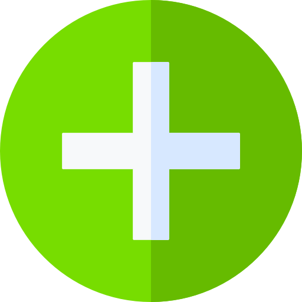
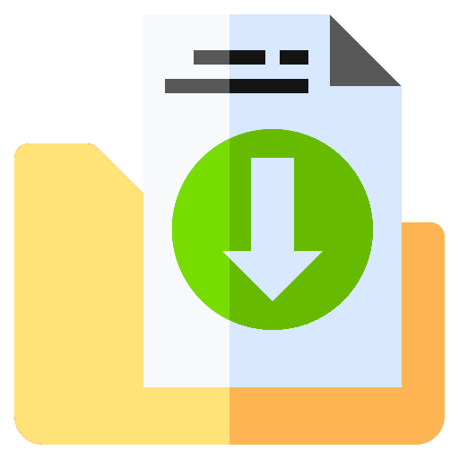
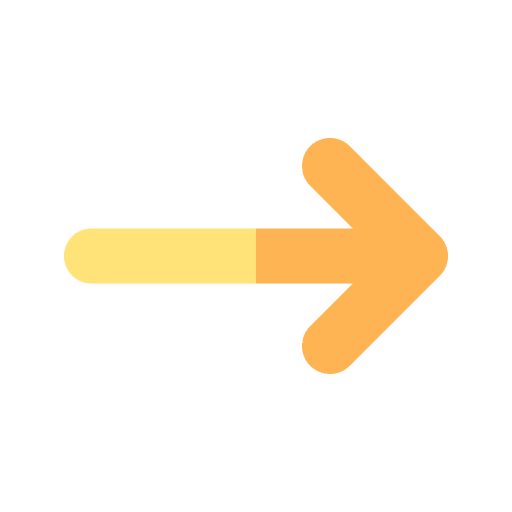

# Theming

## Color Scheme

The color scheme will be based on the application icon.

Enabled controls will use the colored variant. Disabled controls will use a monochrome variant.

Differnt base colors differentiate between different categories of actions.

| Color Group | Color Name   | Color Code | Example                        | Usage                 |
| ----------: | :----------- | :--------- | :----------------------------- | :-------------------- |
|     Primary | yellow       | #ffe278    |        | navigation            |
|     Primary | light orange | #ffb454    |  | navigation            |
|   Secondary | light blue   | #7ed8f6    |    | navigation            |
|   Secondary | blue         | #6aa9ff    |          | small indicator icons |
|   Secondary | dark blue    | #4895ff    |     | small indicator icons |
|   Secondary | dark purple  | #3d4566    |   | small indicator icons |
|   Secondary | purple       | #4d5e80    |        | small indicator icons |
|   Secondary | light purple | #f379ca    |  | small indicator icons |
|      Accent | dark red     | #e56722    |      | destructive actions   |
|      Accent | red          | #f37b2a    |           | destructive actions   |
|      Accent | dark green   | #66bb00    |    | adding, saving        |
|      Accent | light green  | #77dd00    |   | adding, saving        |
|      Accent | dark orange  | #ff7d47    |   | destructive actions   |
|      Accent | black        | #141414    |         | text, background      |
|      Accent | dark gray    | #585859    |     | text, background      |
|      Accent | light gray   | #d7e8ff    |    | text, background      |
|      Accent | white        | #f7f9fa    |         | text, background      |

## Icons

|       Icon Group | Name                       | Source (must be inserted in clear text)                                                                                                                            | Icon                                                   |
| ---------------: | :------------------------- | :----------------------------------------------------------------------------------------------------------------------------------------------------------------- | :----------------------------------------------------- |
| Application Icon | folder-recolored.png       | <a href="https://www.flaticon.com/free-icons/files-and-folders" title="files-and-folders icons">Files-and-folders icons created by Freepik - Flaticon</a>          |        |
|          Editing | add catalog                | maybe just use the default add button in combination with sth.                                                                                                     |                                                        |
|          Editing | add medium                 | maybe just use the default add button in combination with sth.                                                                                                     |                                                        |
|          Editing | add tag                    | maybe just use the default add button in combination with sth.                                                                                                     |                                                        |
|          Editing | add part                   | maybe just use the default add button in combination with sth.                                                                                                     |                                                        |
|          Editing | add-recolored.png          | <a href="https://www.flaticon.com/free-icons/plus" title="plus icons">Plus icons created by Freepik - Flaticon</a>                                                 |           |
|          Editing | writing-recolored-blue.png | <a href="https://www.flaticon.com/free-icons/edit" title="edit icons">Edit icons created by IconKanan - Flaticon</a>                                               |  |
|          Editing | favorite-recolored.png     | <a href="https://www.flaticon.com/free-icons/favorite" title="favorite icons">Favorite icons created by Aldo Cervantes - Flaticon</a>                              |      |
|          Editing | save-recolored.png         | <a href="https://www.flaticon.com/free-icons/save" title="save icons">Save icons created by Aldo Cervantes - Flaticon</a>                                          |          |
|          Editing | undo-recolored.png         | <a href="https://www.flaticon.com/free-icons/undo" title="undo icons">Undo icons created by Freepik - Flaticon</a>                                                 |          |
|          Editing | trash-recolored.png        | <a href="https://www.flaticon.com/free-icons/trash" title="trash icons">Trash icons created by Freepik - Flaticon</a>                                              |         |
|          Editing | checkbox neutral           | may be built in                                                                                                                                                    |                                                        |
|          Editing | checkbox positive          | may be built in                                                                                                                                                    |                                                        |
|          Editing | checkbox negative          | may be built in                                                                                                                                                    |                                                        |
|       Management | export-recolored.png       | <a href="https://www.flaticon.com/free-icons/export" title="export icons">Export icons created by surang - Flaticon</a>                                            |        |
|       Management | import-recolored.png       | <a href="https://www.flaticon.com/free-icons/import" title="import icons">Import icons created by surang - Flaticon</a>                                            |        |
|       Navigation | left-recolored.png         | <a href="https://www.flaticon.com/free-icons/ui" title="ui icons">Ui icons created by Oetjandra - Flaticon</a>                                                     |          |
|       Navigation | previous-recolored.png     | <a href="https://www.flaticon.com/free-icons/arrow" title="arrow icons">Arrow icons created by Yogi Aprelliyanto - Flaticon</a>                                    |      |
|       Navigation | next-recolored.png         | <a href="https://www.flaticon.com/free-icons/arrow" title="arrow icons">Arrow icons created by Yogi Aprelliyanto - Flaticon</a> (the same as the previous variant) |          |
|       Navigation | next random                | use the undo icon here but in the other direction                                                                                                                  |                                                        |
|       Navigation | playlist-recolored.png     | <a href="https://www.flaticon.com/free-icons/add-to-playlist" title="add to playlist icons">Add to playlist icons created by Freepik - Flaticon</a>                |      |
|       Navigation | box-recolored.png          | <a href="https://www.flaticon.com/free-icons/unboxing" title="Unboxing icons">Unboxing icons created by Freepik - Flaticon</a>                                     |           |
|       Navigation | wachstum-recolored.png     | <a href="https://www.flaticon.com/de/kostenlose-icons/seo-bericht" title="seo-bericht Icons">Seo-bericht Icons erstellt von Muhammad_Usman - Flaticon</a>          |      |
|       Navigation | tag-recolored.png          | <a href="https://www.flaticon.com/free-icons/tag" title="tag icons">Tag icons created by Freepik - Flaticon</a>                                                    |           |
|       Navigation | settings.png               | <a href="https://www.flaticon.com/free-icons/settings" title="settings icons">Settings icons created by Freepik - Flaticon</a>                                     |                |
|       Navigation | analyse-recolored.png      | <a href="https://www.flaticon.com/de/kostenlose-icons/analyse" title="analyse Icons">Analyse Icons erstellt von mynamepong - Flaticon</a>                          |       |
|       Navigation | question-recolored.png     | <a href="https://www.flaticon.com/free-icons/question" title="question icons">Question icons created by Freepik - Flaticon</a>                                     |      |
