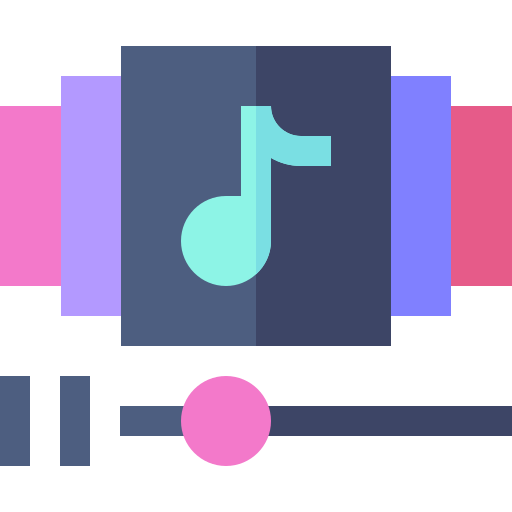

# Theming

## Color Scheme

The color scheme will be based on the application icon.

Enabled controls will use the colored variant. Disabled controls will use a monochrome variant.

Differnt base colors differentiate between different categories of actions.

- destructive actions are highlighted in dark orange
- adding and saving is highlighted in dark green
- navigation is highlighted in blue, yellow or orange
- small indicator icons are blue or purple

General idea for the color scheme:

- Primary Color: yello pallette
- Secondary Color: blue pallette, up to purple
- Accent Color: red, orange, black, white

## Icons

|       Icon Group | Name              | Source (must be inserted in clear text)                                                                                                                   | Icon                                     | Needed improvement                                       |
| ---------------: | :---------------- | :-------------------------------------------------------------------------------------------------------------------------------------------------------- | :--------------------------------------- | :------------------------------------------------------- |
| Application Icon | folder.png        | <a href="https://www.flaticon.com/free-icons/files-and-folders" title="files-and-folders icons">Files-and-folders icons created by Freepik - Flaticon</a> |    | make circle in the middle dark                           |
|          Editing | add catalog       | maybe just use the default add button in combination with sth.                                                                                            |                                          |                                                          |
|          Editing | add medium        | maybe just use the default add button in combination with sth.                                                                                            |                                          |                                                          |
|          Editing | add tag           | maybe just use the default add button in combination with sth.                                                                                            |                                          |                                                          |
|          Editing | add part          | maybe just use the default add button in combination with sth.                                                                                            |                                          |                                                          |
|          Editing | add.png           | <a href="https://www.flaticon.com/free-icons/plus" title="plus icons">Plus icons created by Freepik - Flaticon</a>                                        |       | colors                                                   |
|          Editing | writing.png       | <a href="https://www.flaticon.com/free-icons/edit" title="edit icons">Edit icons created by IconKanan - Flaticon</a>                                      |   | colors                                                   |
|          Editing | favorite.png      | <a href="https://www.flaticon.com/free-icons/favorite" title="favorite icons">Favorite icons created by Aldo Cervantes - Flaticon</a>                     |  | colors                                                   |
|          Editing | save.png          | <a href="https://www.flaticon.com/free-icons/save" title="save icons">Save icons created by Aldo Cervantes - Flaticon</a>                                 |      | colors                                                   |
|          Editing | undo.png          | <a href="https://www.flaticon.com/free-icons/undo" title="undo icons">Undo icons created by Freepik - Flaticon</a>                                        |      | colors                                                   |
|          Editing | trash.png         | <a href="https://www.flaticon.com/free-icons/trash" title="trash icons">Trash icons created by Freepik - Flaticon</a>                                     |     | colors                                                   |
|          Editing | checkbox neutral  | may be built in                                                                                                                                           |                                          |                                                          |
|          Editing | checkbox positive | may be built in                                                                                                                                           |                                          |                                                          |
|          Editing | checkbox negative | may be built in                                                                                                                                           |                                          |                                                          |
|       Management | export.png        | <a href="https://www.flaticon.com/free-icons/export" title="export icons">Export icons created by surang - Flaticon</a>                                   |    | colors                                                   |
|       Management | import.png        | <a href="https://www.flaticon.com/free-icons/import" title="import icons">Import icons created by surang - Flaticon</a>                                   |    | colors                                                   |
|       Navigation | left.png          | <a href="https://www.flaticon.com/free-icons/ui" title="ui icons">Ui icons created by Oetjandra - Flaticon</a>                                            |      | colors                                                   |
|       Navigation | previous.png      | <a href="https://www.flaticon.com/free-icons/arrow" title="arrow icons">Arrow icons created by Yogi Aprelliyanto - Flaticon</a>                           |  | colors, variant for right, halve the colors horizontally |
|       Navigation | next random       | use the undo icon here but in the other direction                                                                                                         |                                          |                                                          |
|       Navigation | playlist.png      | <a href="https://www.flaticon.com/free-icons/add-to-playlist" title="add to playlist icons">Add to playlist icons created by Freepik - Flaticon</a>       |  | colors                                                   |
|       Navigation | box.png           | <a href="https://www.flaticon.com/free-icons/unboxing" title="Unboxing icons">Unboxing icons created by Freepik - Flaticon</a>                            |       | colors                                                   |
|       Navigation | wachstum.png      | <a href="https://www.flaticon.com/de/kostenlose-icons/seo-bericht" title="seo-bericht Icons">Seo-bericht Icons erstellt von Muhammad_Usman - Flaticon</a> |  | colors, halve the colors vertically                      |
|       Navigation | tag.png           | <a href="https://www.flaticon.com/free-icons/tag" title="tag icons">Tag icons created by Freepik - Flaticon</a>                                           |       | colors                                                   |
|       Navigation | settings.png      | <a href="https://www.flaticon.com/free-icons/settings" title="settings icons">Settings icons created by Freepik - Flaticon</a>                            |  | colors                                                   |
|       Navigation | analyse.png       | <a href="https://www.flaticon.com/de/kostenlose-icons/analyse" title="analyse Icons">Analyse Icons erstellt von mynamepong - Flaticon</a>                 |   | colors, halve the colors horizontally                    |
|       Navigation | question.png      | <a href="https://www.flaticon.com/free-icons/question" title="question icons">Question icons created by Freepik - Flaticon</a>                            |  | colors                                                   |
