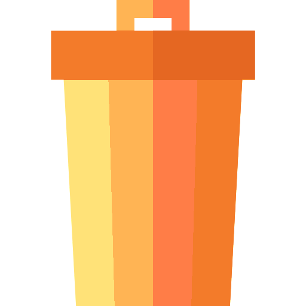
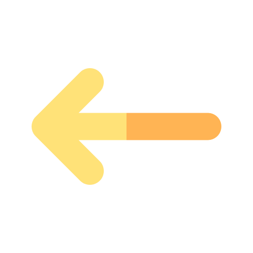

# Style Guide

## Window Styling

### General Window Regions

- Navigation Bar: contains all main actions as buttons
  - Section 1: Navigation
  - Section 2: Editing
  - End: Help
- Left and Right Panel:
  - the left panel contains actions relevant for the right panel (e.g. selecting from a list)
  - the left and right panel can also be merged together to a singular panel
  - the left and right panel can also be completely unrelated
- Status Bar: contains status messages

> The general control flow is from top to bottom and from left to right.

### Control Flow Examples

## Font

| Usage        | Font     | Font Size | Variant               | Sample                                                                          |
| :----------- | :------- | --------: | :-------------------- | :------------------------------------------------------------------------------ |
| Window Title | Consolas |        35 | bold                  | <b>Window Title</b> |
| Sub Title    | Consolas |        25 | regular               | Sub Title           |
| Small Title  | Consolas |        16 | regular               | Small Title         |
| Normal Text  | Consolas |        12 | regular, italic, bold | Normal Text         |
| Small Text   | Consolas |        10 | regular, italic       | <i>Small Text</i>   |

## Color Scheme

The color scheme will be based on the application icon.

Enabled controls will use the colored variant. Disabled controls will use a monochrome variant.

Differnt base colors differentiate between different categories of actions.

| Color Group | Color Name   | Color Code | Example                        | Usage                 |
| ----------: | :----------- | :--------- | :----------------------------- | :-------------------- |
|     Primary | yellow       | #ffe278    |        | navigation            |
|     Primary | light orange | #ffb454    |  | navigation            |
|   Secondary | light blue   | #7ed8f6    |    | navigation            |
|   Secondary | blue         | #6aa9ff    |          | small indicator icons |
|   Secondary | dark blue    | #4895ff    |     | small indicator icons |
|    Tertiary | dark purple  | #3d4566    |   | small indicator icons |
|    Tertiary | purple       | #4d5e80    |        | small indicator icons |
|    Tertiary | light purple | #f379ca    |  | small indicator icons |
|      Accent | dark red     | #e56722    |      | destructive actions   |
|      Accent | light red    | #f37b2a    |           | destructive actions   |
|      Accent | dark green   | #66bb00    |    | adding, saving        |
|      Accent | light green  | #77dd00    |   | adding, saving        |
|      Accent | dark orange  | #ff7d47    |   | destructive actions   |
|      Accent | black        | #141414    |         | text, background      |
|      Accent | dark gray    | #585859    |     | text, background      |
|      Accent | light gray   | #d7e8ff    |    | text, background      |
|      Accent | white        | #f7f9fa    |         | text, background      |

## Icons

|       Icon Group | Name                 | Source (must be inserted in clear text)                                                                                                                            | Icon                                                        |
| ---------------: | :------------------- | :----------------------------------------------------------------------------------------------------------------------------------------------------------------- | :---------------------------------------------------------- |
| Application Icon | icon.png             | <a href="https://www.flaticon.com/free-icons/files-and-folders" title="files-and-folders icons">Files-and-folders icons created by Freepik - Flaticon</a>          |                |
|          Editing | add catalog          | maybe just use the default add button in combination with sth.                                                                                                     |                                                             |
|          Editing | add medium           | maybe just use the default add button in combination with sth.                                                                                                     |                                                             |
|          Editing | add tag              | maybe just use the default add button in combination with sth.                                                                                                     |                                                             |
|          Editing | add part             | maybe just use the default add button in combination with sth.                                                                                                     |                                                             |
|          Editing | add.png              | <a href="https://www.flaticon.com/free-icons/plus" title="plus icons">Plus icons created by Freepik - Flaticon</a>                                                 |                  |
|          Editing | edit_blue.png        | <a href="https://www.flaticon.com/free-icons/edit" title="edit icons">Edit icons created by IconKanan - Flaticon</a>                                               |            |
|          Editing | favorite.png         | <a href="https://www.flaticon.com/free-icons/favorite" title="favorite icons">Favorite icons created by Aldo Cervantes - Flaticon</a>                              |             |
|          Editing | save.png             | <a href="https://www.flaticon.com/free-icons/save" title="save icons">Save icons created by Aldo Cervantes - Flaticon</a>                                          |                 |
|          Editing | undo.png             | <a href="https://www.flaticon.com/free-icons/undo" title="undo icons">Undo icons created by Freepik - Flaticon</a>                                                 |                 |
|          Editing | delete.png           | <a href="https://www.flaticon.com/free-icons/trash" title="trash icons">Trash icons created by Freepik - Flaticon</a>                                              |               |
|          Editing | checkbox neutral     | may be built in                                                                                                                                                    |                                                             |
|          Editing | checkbox positive    | may be built in                                                                                                                                                    |                                                             |
|          Editing | checkbox negative    | may be built in                                                                                                                                                    |                                                             |
|       Management | export.png           | <a href="https://www.flaticon.com/free-icons/export" title="export icons">Export icons created by surang - Flaticon</a>                                            |            |
|       Management | import.png           | <a href="https://www.flaticon.com/free-icons/import" title="import icons">Import icons created by surang - Flaticon</a>                                            |            |
|       Navigation | back.png             | <a href="https://www.flaticon.com/free-icons/ui" title="ui icons">Ui icons created by Oetjandra - Flaticon</a>                                                     |              |
|       Navigation | previous.png         | <a href="https://www.flaticon.com/free-icons/arrow" title="arrow icons">Arrow icons created by Yogi Aprelliyanto - Flaticon</a>                                    |          |
|       Navigation | next.png             | <a href="https://www.flaticon.com/free-icons/arrow" title="arrow icons">Arrow icons created by Yogi Aprelliyanto - Flaticon</a> (the same as the previous variant) |              |
|       Navigation | next_random.png      | <a href="https://www.flaticon.com/free-icons/undo" title="undo icons">Undo icons created by Freepik - Flaticon</a> (the same as the undo variant)                  |       |
|       Navigation | playlist.png         | <a href="https://www.flaticon.com/free-icons/add-to-playlist" title="add to playlist icons">Add to playlist icons created by Freepik - Flaticon</a>                |          |
|       Navigation | title_of_the_day.png | <a href="https://www.flaticon.com/free-icons/unboxing" title="Unboxing icons">Unboxing icons created by Freepik - Flaticon</a>                                     |  |
|       Navigation | statistics.png       | <a href="https://www.flaticon.com/de/kostenlose-icons/seo-bericht" title="seo-bericht Icons">Seo-bericht Icons erstellt von Muhammad_Usman - Flaticon</a>          |        |
|       Navigation | tag.png              | <a href="https://www.flaticon.com/free-icons/tag" title="tag icons">Tag icons created by Freepik - Flaticon</a>                                                    |               |
|       Navigation | settings.png         | <a href="https://www.flaticon.com/free-icons/settings" title="settings icons">Settings icons created by Freepik - Flaticon</a>                                     |          |
|       Navigation | analyze.png          | <a href="https://www.flaticon.com/de/kostenlose-icons/analyse" title="analyse Icons">Analyse Icons erstellt von mynamepong - Flaticon</a>                          |           |
|       Navigation | help.png             | <a href="https://www.flaticon.com/free-icons/question" title="question icons">Question icons created by Freepik - Flaticon</a>                                     |              |
